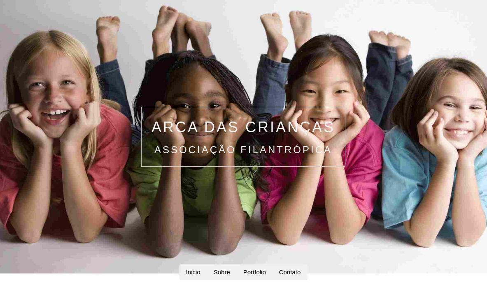
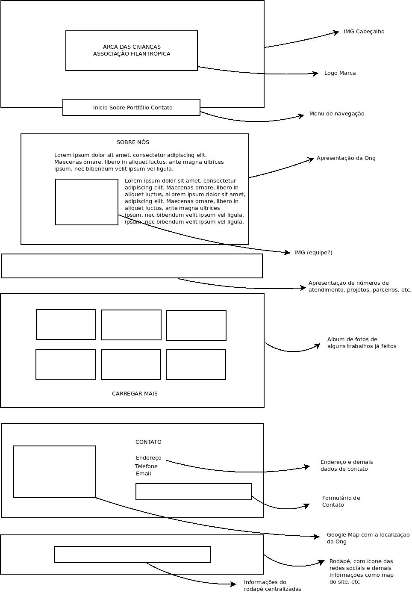

# Arca Das Crianças
Projeto base do desafio do PI Grupo 005 - PJI240.
### Nota importante
Este projeto esta em desenvolvimento e deverá atender as seguintes caracteristicas.

## Problema a ser resolvido
A mesma precisando de um web site que apresente informações sobre suas atividades
e que permita fazer registro de informações dos alunos, facilitando pesquisas, dado
dados e que garanta a segurança das informações armazenadas.
Também deve ser um facilitador para a comunicação entre a ONG, responsáveis e a
comunidade.

## Objetivo
Facilitar a busca e recuperação das informações, assim como assegurar a
integridade dos dados, promovendo um canal de comunicação com a comunidade.

## Tecnologias em uso
- [W3C.CSS](href="https://www.w3schools.com/w3css/4/w3.css)
- [HTML](https://www.w3.org/standards/webdesign/htmlcss)
- [CSS3](https://www.cssportal.com/)
- [Java Script](https://www.javascript.com/)
- [Font Awesome](https://fontawesome.com/v4/icons/#new)
- [Foot Google](https://fonts.googleapis.com/)

## Editor de código usado para o desenvolvimento do projeto
- [ATOM  - A hackable text editor for the 21st Century](https://atom.io/)

## Protótipo para o projeto
Este é um protótipo sugestivo com base nas informações até então recompradas
junto ao cliente e na web.

## Link para demostração do prototipo

Acesse a demostração deste prototipo [AQUI](https://webstack.com.br/projetos/arcadascriancas/).
